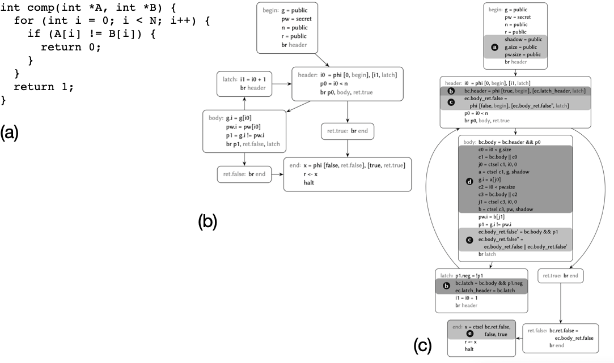
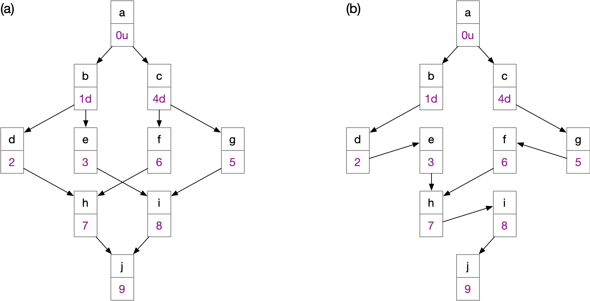

# Side-Channel Elimination via Partial Control-Flow Linearization

This repository contains the implementation of the techniques
described in the paper "Side-Channel Elimination via Partial Control-Flow Linearization", 
which is currently under review. [Partial
control-flow linearization](https://dl.acm.org/doi/abs/10.1145/3296979.3192413)
is a code transformation technique invented by folks from
[Saarland-U's Compiler Design Lab](http://www.cdl.uni-saarland.de/) to
maximize work performed in vectorized programs. In this paper, we find
a new service for it. We show that partial control-flow linearization
protects programs against timing attacks. This transformation delivers
many good properties:

1. It is sound: given an instance of its public inputs, the partially
linearized program always runs the same sequence of instructions,
regardless of secret inputs.
2. If the original program is publicly safe, then accesses to the data
cache will be data oblivious in the transformed code.
3. It is optimal: every branch that depends on some secret data is
linearized; no branch that depends on only public data is linearized.
4. It preserves loops that depend on public information. If every
branch that leaves a loop depends on secret data, then the transformed
program will not terminate.

## What are we doing?

The figure below shows what we are doing. Basically, we start up with
a program like the one in part (a) of the figure. This program reads
public and secret information. We want to transform it so that,
regardless of the secret inputs that it receives, it always runs the
same sequence of operations. Our approach works on the intermediate
representation of the program, that is, on its [control-flow graph
(CFG)](https://en.wikipedia.org/wiki/Control-flow_graph). The CFG of
our example can be seen in part (b) of the figure below.

We then use partial control-flow linearization, plus a lot of
rewriting rules, to convert the program seen in part (b) above into
the program seen in part (c), also above. Our transformation will
create some new variables, like those seen in (c-a), to preserve
safety. That is, we will never introduce out-of-bounds errors in a
program that did not have them before. We will also modify [phi
functions](https://en.wikipedia.org/wiki/Static_single_assignment_form),
so that we can preserve the semantics of the program, like seen in
(c-b) above. Something very important is that we are handling loops
and eliminating exits that branch on secret information. That requires
quite a lot of code acrobatics. Part (c-c) above shows extensions that
we insert into the code to ensure that once we leave a loop, we
continue executing where the original, non-transformed program, would
have gone. We also need to transform memory operations, namely loads
and stores. Stores, in particular, are tricky, for they implement the
observable semantics of the program. Part (c-d) above contains code
inserted to rewrite a store in the original program. Notice that we
use selectors all the time, to implement
[predication](https://en.wikipedia.org/wiki/Predication_(computer_architecture)).
In other words, instructions will only have effects if they would have
these effects in the original program. And for that, we use the
selectors (ctsel) to decide if such is the case or not. As an example,
we are using a selector in part (c-e) above, to find the correct value
to store in variable r, which is the return value of the target
function.

## What is Partial Control-Flow Linearization (PCFL)?

As mentioned, PCFL is a code optimization technique, originally
invented to speedup execution of vectorized code. The idea is to
remove branches from a program, but not all of them (that's why the
approach is called "partial"). The partially linearized program has
many properties. In particular, the transformation preserves dominance
and post-dominance relations. Below we show a example of partially
linearized program:

Yet, notice that our transformation differs a bit from the original
description of partial control-flow linearization. In particular, we
had to consider dependencies in a different way. If we consider
control dependencies indiscriminately, then a single tainted exit in a
loop would be enough to taint every branch in the loop, and no
termination would be possible. Our paper explains some of these
changes in the original algorithm.

## How this Repo is Organized

* `lif`: That is the actual implementation of our transformation,
in the [Low-Level Virtual Machine (LLVM)](https://llvm.org/). It
was implemented with LLVM 13.0 and currently works as a tool based
on the LLVM API. For more details on how to build and use it, 
check the README inside folder [lif/](lif/).

* `lif/test`: This folder contains the test framework that we used
to verify the correctness of the prototype. All the benchmarks that
we used can be found at [lif/test/benchmarks/](lif/test/benchmarks/). For more details, check
the README in [lif/test/](lif/test/).
